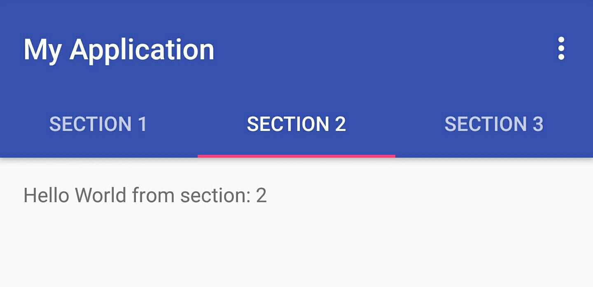

[toc]

# 액션바 (Action Bar)

액션바는 최근에 중요하게 취급되는 디자인 요소 중의 하나이다. 애플리케이션 간에 일관성 있는 인터페이스를 사용자에게 제공하는 의미에서 개발자들은 애플리케이션에서 액션바를 사용하는 것이 권장된다. 액션바의 동작 및 표시 여부는 액션바의 API를 동하여 제어가 가능하다. 액션바 API는 안드로이드 3.0부터 추가되었다. 

**<액션바의 주 용도>**
- (새로 만들기나 검색 등과 같은) 중요한 동작을 눈에 띄게 하고 기대했던대로 사용할 수 있게 한다.
- 앱 내의 일관된 탐색과 뷰 전환을 지원한다.
- 별로 사용하지 않는 액션을 액션 오버플로우로 제공하여 산만함을 줄여준다.
- 앱에 아이덴티티를 부여하는 전용 공간을 제공한다.


##액션바의 기본적인 구성 


1. **애플리케이션 아이콘**
- 애플리케이션의 식별을 위한 것이다. 원할 경우 다른 로고나 브랜드로 교체할 수도 있다.


2. **뷰 컨트롤**
- 만약 애플리케이션이 여러가지 뷰에서 데이터를 표시하고 있다면, 액션 바의 이 부분은 사용자가 뷰 간을 전활할 수 있도록 해준다.  뷰 전환 컨트롤에는 드롭다운 메뉴나 탭 컨트롤 등이 있다.

3. **액션 버튼**
- 애플리케이션의 중요한 액션들을 표시한다. 액션 바에 들어갈 공간이 없는 액션들은 자동으로 액션 오버플로우 속으로 이동한다.

4. **액션 오버플로우**
- 많이 사용되지 않는 액션들을 보관한다.

## 액션바 추가사항

###분할 액션바

애플리케이션을 만들 때 고려해야 할 중요한 UI 이슈 중 하나는 어떻게 다양한 기기의 화면 크기와 화면 회전에 맞출 것인가 하는 점이다.

분할 액션 바를 사용해 이런 변경에 대응할 수 있는데, 분할 액션 바는 메인 액션 바 밑 혹은 화면 하단 등에 배치하는 다중 바로 액션 바 컨텐츠를 분배할 수 있도록 해준다. 

여러 액션 바로 컨텐츠를 분리할 때, 일반적으로 액션 바 컨텐츠를 배치할 수 있는 세 곳의 위치가 있다.

1. **메인 액션 바**
2. **상단 **
3. **하단 바**

만약 사용자가 현재 화면에서 상위 계층으로 이동할 수 있다면, 메인 액션 바에는 적어도 상위 기호는 표시하고 있어야 한다.

사용자가 빠르게 애플리케이션에서 제공하는 뷰 간을 전환할 수 있도록, 상단 바에 탭이나 스피너를 배치하고, 필요하면 액션과 액션 오버 플로우는 하단 바를 배치하는게 좋다. 

###Up 네비게이션


사용자가 상위계층으로 이동할 수 있도록 해준다.

**<부모 액티비티 명시>**
``` 
		 <activity
            android:name=".SubActivity"
            android:label="Sub 액티비티"
            android:parentActivityName=".MainActivity">
            <meta-data
                android:name="android.support.PARENT_ACTIVITY"
                android:value=".MainActivity" />
        </activity>
``` 
activity 속성에서  android:parentActivityName을 통해 부모 액티비티를 명시해준다. 이런 방법으로 상위 액티비티를 명시해주면 NavUtils API를 이용하여 적절한 상위 액티비티로 이동할 수 있다. 

**<UP 버튼 추가하기>**
``` 
@Override
    protected void onCreate(Bundle savedInstanceState) {
        super.onCreate(savedInstanceState);
        setContentView(R.layout.activity_sub);

        getSupportActionBar().setDefaultDisplayHomeAsUpEnabled(true);
    }
``` 
setDefaultDisplayHomeAsUpEnabled()가 true이면 액션 바의 좌측에 UP버튼 생기는데 이 버튼을 누르면 onOptionsItemSelected() 메소드를 호출된다. 이때 발생하는 동작에 대한 고유 ID는 android.R.id.Home이다.

**<부모 액티비티로 이동하기>**
``` 
 @Override
    public boolean onOptionsItemSelected(MenuItem item) {

        switch (item.getItemId()){
            case android.R.id.home:
                NavUtils.navigateUpFromSameTask(this);
                return true;
        }
        return super.onOptionsItemSelected(item);
    }
``` 
부모 액티비티가 onNewIntent()를 호출할 수 있느냐에 따라 back stack에서 앞으로 가져오는 방법이 달라진다. 

만약 부모 액티비티가  singleTop 모드나  불려졌거나 , 인텐트에FLAG_ACTIVITY_CLEAR_TOP을 포함하고 있다면,  부모 액티비티는 stack의 맨 위로 온다. 그렇지 않은 경우는 stack에서 pop되고 난 후, 새로운 부모 액티비트 객체를 생성한다. 

###네비게이션 탭



###드롭다운 네비게이션


