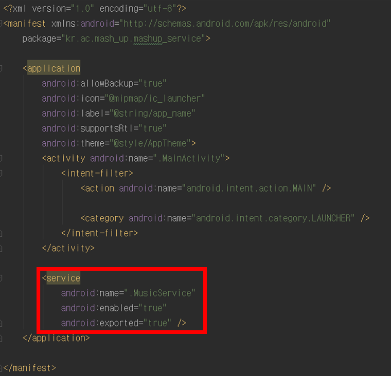
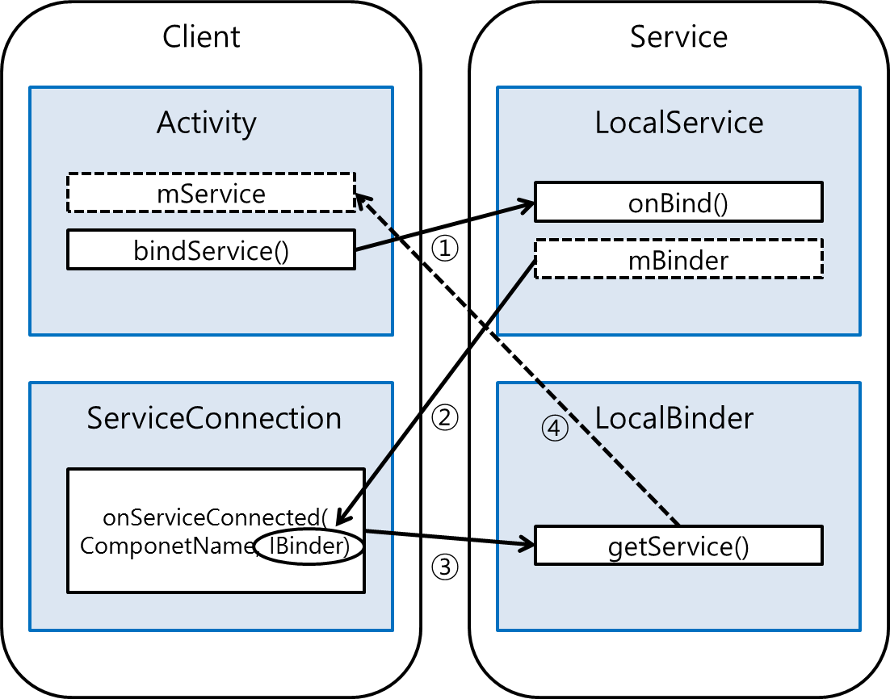
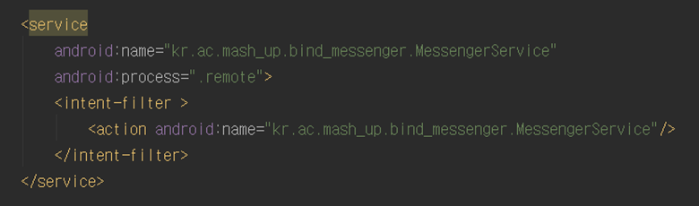

[TOC]

# 안드로이드 Service

안드로이드 Application을 구성하는 4가지 컴포넌트 중 하나이며, Activity와 달리 사용자 인터페이스 없이 Background에서 동작하는 컴포넌트이다. 

Service는 Activity 화면에서 동작뿐만 아니라, Activity가 종료되어 있는 상태에서도 동작하기 위해 만들어졌기 때문에 배경 음악을 재생한다든지, 특정한 웹 사이트에서 주기적으로 데이터를 읽어온다든지, 주기적으로 폰의 사용량을 계산한다든지, 애플리케이션의 업데이트를 주기적으로 검사한다든지의 경우에 사용된다. 

##Service 종류

> **startService()** 
 >- 한번 시작되면 백그라운드에서 무한정 실행될 수 있음
 >- 보통은 처리를 완려하면 스스로 자신을 종료시킴
 >- ex) 파일 다운로드, 음악재생

> **bindService()** 
>- 클라이언트 - 서버와 같이 동작
>- 액티비티가 서비스에게 어떤 요청을 하고 결과값을 받을 수 있음
>- 액티비티와 연결되어 있는 동안에만 실행됨 
>- 하나의 서비스에는 다수의 액티비티가 연결될 수 있음


##주의사항

**manifest 선언**
서비스도 액티비티와 마찬가지로 인텐트 객체를 이용하여 시작한다. 그리고 다른 애플리케이션에서 해당 서비스에 접근하기 위해선 서비스가 manifest에 공용으로 선언되어야 한다. 

**별도의 Thread 사용**
모든 컴포넌트들은 Main Thread 안에 실행된다.  즉 서비스는 새로운 Thread로 실행되지 않는다. 따라서 만약 CPU를 많이 사용하는 작업의 경우에는 서비스 안에서 새로운 Thread를 생성하는 것이 좋다. 
=> `별도의 Thread를 사용함으로써 ANR(Application Not Responding)과 같은 오류를 줄일 수 있고 Main Thread는 사용자 상호작용에만 전념할 수 있다. `

##StartService 기초

``` 
public class MyService extends Service {

}
```
서비스는 Service라는 클래스를 상속받아 작성한다.
``` 
    @Override
    public void onCreate() {
       
    }
```
서비스가 처음으로 생성되면 호출된다. 이 메소드 안에서 초기의 설정 작업들을 수행하면 된다.  
``` 
    @Override
    public int onStartCommand(Intent intent, int flags, int startId) {
        
    }
```
다른 컴포넌트가 startService()를 호출하여서 서비스가 시작되면 이 메서드가 호출된다. 작업이 완료되었을 경우에 stopSelf()나 stopService()를 호출하여 서비스를 종료시켜야 한다. 그렇지 않으면 무한정 실행된다. 만약 BindService를 구현한다면 이 메서드는 재정의할 필요 없다.
``` 
    @Override
    public void onDestroy() {
   }
```
서비스가 종료될 때 실행되는 메서드이다. 개발자는 반드시 이 메서드를 구현해야 하는데 주로 스레드나 리스너같은 자원들을 정리하는 데 사용하면 된다. 

##StartService() 실습
### Service (Main Thread) : 음악 재생 예제


1. xml 파일 정의
``` 
<TextView
        android:layout_width="match_parent"
        android:layout_height="wrap_content"
        android:textSize="20sp"
        android:gravity="center"
        android:text="Music Service Test" />

    <Button
        android:layout_width="match_parent"
        android:layout_height="wrap_content"
        android:text="Start"
        android:id="@+id/btn_start"
        android:onClick="musicService"/>

    <Button
        android:layout_width="match_parent"
        android:layout_height="wrap_content"
        android:text="Stop"
        android:id="@+id/btn_stop"
        android:onClick="musicService"/>
```
2. Service 클래스 생성


Java 폴더에서 마우스 오른쪽 버튼 클릭 후 [New] - [Service] - [Service]




3. Service 클래스 작성
<raw 폴더>
손실 압축을 하지 않고 가능한 모든 정보를 저장하여 데이터를 센서에서 직접 얻은 날것(raw) 그대로 사용한다. 


``` 
public class MusicService extends Service {
    private static final String TAG = "음악 서비스";

    MediaPlayer player;

    @Override
    public IBinder onBind(Intent intent) {
        return null;
    }

    @Override
    public void onCreate() {
        Log.d(TAG, "service onCreate()");

        player = MediaPlayer.create(this, R.raw.bari);
        player.setLooping(false);
    }

    @Override
    public int onStartCommand(Intent intent, int flags, int startId) {
        Toast.makeText(this, "Music Service가 시작되었습니다.", Toast.LENGTH_SHORT).show();
        Log.d(TAG, "service onStartCommand()");
        player.start();
        return super.onStartCommand(intent, flags, startId);
    }

    @Override
    public void onDestroy() {
        Toast.makeText(this, "Music Service가 중지되었습니다.", Toast.LENGTH_SHORT).show();
        Log.d(TAG, "service onDestroy()");
        player.stop();
    }
}
```
4. 액티비티 작성
``` 
public class MainActivity extends AppCompatActivity {

    private static final String TAG = "음악 서비스";

    Button btn_start, btn_stop;

    public void musicService(View v){
        switch (v.getId()){
            case R.id.btn_start:
                Log.d(TAG, "START 버튼");
                startService(new Intent(this, MusicService.class ));
                break;
            case R.id.btn_stop:
                Log.d(TAG, "STOP 버튼");
                stopService(new Intent(this, MusicService.class));
                break;

        }
    }

    @Override
    protected void onCreate(Bundle savedInstanceState) {
        super.onCreate(savedInstanceState);
        setContentView(R.layout.activity_main);

        btn_start = (Button) findViewById(R.id.btn_start);
        btn_stop = (Button) findViewById(R.id.btn_stop);
    }
}
```
### IntentService (Worker Thread) : 다운로드 예제


1. xml 파일 정의
``` 
<Button
        android:layout_width="match_parent"
        android:layout_height="wrap_content"
        android:text="Download"
        android:onClick="downloadClick"/>
```
2. IntentService 클래스 생성


**<IntentService 클래스의 장점>**
IntentService 클래스에서는 콜백 메서드에 대하여 디폴트 구현을 제공한다. 따라서 개발자가 별도로 콜백 메서드를 구현한 필요가 없다. 개발자는 단지 onHandleIntent()에 클라이언트가 요청한 작업을 하면 된다. 또 요청이 처리되면 자동적으로 서비스를 중단하기 때문에 stopSelf()를 호출할 필요가 없다. 

3. IntentService 클래스 작성
``` 
public class MyIntentService extends IntentService {
    private int result = Activity.RESULT_CANCELED;

    public MyIntentService() {
        super("MyIntentService");
    }

    @Override
    protected void onHandleIntent(Intent intent) {
        Uri data = intent.getData();
        String urlPath = intent.getStringExtra("urlpath");
        String buffer = " ";

        InputStream stream = null;

        try {
            URL url = new URL(urlPath);
            stream = url.openConnection().getInputStream();
            InputStreamReader reader = new InputStreamReader(stream);

            int i = 0, next = -1;
            while((next = reader.read()) != -1){

                Log.v("바이트 읽기", String.valueOf(next));
                buffer += " " + (char) next;
                Log.v("바이트 읽기", buffer);
                if (++i > 100) break;
            }

            result = Activity.RESULT_OK;

        } catch (Exception e) {
            e.printStackTrace();
        } finally {
            if (stream != null){
                try {
                    stream.close();
                }catch (IOException e){
                    e.printStackTrace();
                }
            }
        }

        Bundle extras = intent.getExtras();

        if (extras != null){
            Messenger messenger = (Messenger) extras.get("MESSENGER");
            Message msg = Message.obtain();
            msg.arg1 = result;
            msg.obj = buffer;
            try {
                messenger.send(msg);
            }catch (android.os.RemoteException e1){
                Log.w(getClass().getName(), "Exception sending message", e1);
            }
        }
    }

}
```
4. 액티비티 작성
``` 
public class MainActivity extends AppCompatActivity {

    private Handler handler = new Handler(){
        @Override
        public void handleMessage(Message msg) {
            Object path = msg.obj;

            if (msg.arg1 == RESULT_OK && path != null){
                Toast.makeText(getApplicationContext(), " "+path.toString()+"을 다운로드하였음.", Toast.LENGTH_LONG).show();
            }else{
                Toast.makeText(getApplicationContext(), "다운로드 실패", Toast.LENGTH_LONG).show();
            }
        }
    };

    public void downloadClick(View v){
        Intent intent = new Intent(this, MyIntentService.class);
        Messenger messenger = new Messenger(handler);
        intent.putExtra("MESSENGER", messenger);
        intent.setData(Uri.parse("http://www.google.com/index.html"));
        intent.putExtra("urlpath", "http://www.google.com/index.html");
        startService(intent);
    }

    @Override
    protected void onCreate(Bundle savedInstanceState) {
        super.onCreate(savedInstanceState);
        setContentView(R.layout.activity_main);

    }

}

```


##BindService 기초
BindService는 Service 클래스를 상속받아 만들며, 다른 앱컴포넌트들이 그것을 바인드하여 상호작용할 수 있는 서비스를 말한다. 서비스가 바인드 되기 위해서는 onBind() 콜백 메소드를 구현해야 한다.

``` 
    @Override
    public IBinder onBind(Intent intent) {
    
    }
```
다른 컴포넌트가 bindService()을 호출하여 서비스와 연결을 시도하면 이 메소드가 호출된다. 이 메소드 안에서 IBinder을 반환해 통신하는 데 사용하는 인터페이스를 제공해야 한다. 만약 연결을 원하지 않으면 null을 반환하면 된다.




1. 클라이언트는 bindService()를 호출하여 서비스에 바인드할 수 있다. 
2. 2bindService()를 호출할 때 인자로 ServiceConnection의 구현객체를 전달하는데, 이것은 서비스와의 연결상태를 모니터링하는 역할을 한다. 
3. 안드로이드 시스템에 의해 클라이언트와 서비스가 연결되면 ServiceConnection 구현 객체의onServiceConnected() 메소드가 호출되며, 여기에서 서비스와 통신할 수 있는 IBinder 객체를 전달 받는다.
4. 그 이후부턴 위의 그림상 Service를반환받은 mService 변수를 통해서 서비스를 자신의 메서드처럼 호출해서 사용할 수 있다.


##BindService() 실습

### Binder 클래스(Local Service) : 난수 생성하기

앱 내에서만 사용하고, 같은 프로세스 내에 있는 클라이언트에게만 바인드 되는 서비스라면, onBind()에서 Binder 클래스를 확장한 객체를 리턴해주면 된다.


1. xml 파일 정의
``` 
<TextView
        android:layout_width="match_parent"
        android:layout_height="wrap_content"
        android:textSize="20sp"
        android:gravity="center"
        android:text="Bind service(Binder)" />

    <Button
        android:layout_width="match_parent"
        android:layout_height="wrap_content"
        android:text="Random"
        android:id="@+id/btn_random"
        android:onClick="randomService"/>
```

2. Service 클래스 작성
``` 
public class LocalService extends Service {

    private final IBinder mBinder = new LocalBinder();

    private final Random mGenerator = new Random();

    public class LocalBinder extends Binder{
        LocalService GetService(){
            return LocalService.this;
        }
    }

    @Override
    public IBinder onBind(Intent intent) {
        return mBinder;
    }

    public int getRandomNumber(){
        return mGenerator.nextInt(100);
    }
}
```
3. 액티비티 작성
``` 
public class MainActivity extends AppCompatActivity {

    LocalService mService;
    boolean mBound = false;

    @Override
    protected void onCreate(Bundle savedInstanceState) {
        super.onCreate(savedInstanceState);
        setContentView(R.layout.activity_main);
    }

    @Override
    protected void onStart() {
        super.onStart();
        Intent intent = new Intent(this, LocalService.class);
        bindService(intent,mConnection, Context.BIND_AUTO_CREATE);
    }

    @Override
    protected void onStop() {
        super.onStop();
        if (mBound){
            unbindService(mConnection);
            mBound = false;
        }
    }

    public void randomService(View v){
        if (mBound){
            int num = mService.getRandomNumber();
            Toast.makeText(this, "number : "+num, Toast.LENGTH_SHORT).show();
        }
    }

    private ServiceConnection mConnection = new ServiceConnection() {
        @Override
        public void onServiceConnected(ComponentName name, IBinder service) {
            LocalService.LocalBinder binder = (LocalService.LocalBinder) service;
            mService = binder.GetService();
            mBound = true;
        }

        @Override
        public void onServiceDisconnected(ComponentName name) {
            mBound = false;
        }
    };
}

```
### Messenger 클래스(Remote Service) 
다른 프로세스들이 서비스를 이용한다면 Messenger를 사용하여 인터페이스를 생성할 수 있다. 서비스는 몇가지 종류의 Messenger 객체에 응답하는 Handler를 정의한다. 이 Handler 안에서 Messenger는 클라이언트와 IBinder 객체를 공유하고, 클라이언트가 Message 객체를 이용하여 서비스에게 명령을 보낼 수 있도록 해준다. Message 객체는 실제로 Handler에 대한 참조 변수로 볼 수 있다. 


1. Service 클래스 작성

``` 
public class MessengerService extends Service {

    static final int MSG_SAY_HELLO = 1;

    class IncomingHandler extends Handler{
        @Override
        public void handleMessage(Message msg) {
            switch (msg.what){
                case MSG_SAY_HELLO:
                    Toast.makeText(getApplicationContext(), "hello!", Toast.LENGTH_SHORT).show();
                    break;
                default:
                    super.handleMessage(msg);
            }
        }
    }

    final Messenger messenger = new Messenger(new IncomingHandler());

    @Override
    public IBinder onBind(Intent intent) {
        Toast.makeText(getApplicationContext(), "binding!", Toast.LENGTH_SHORT).show();
        return messenger.getBinder();
    }
}

```
2. manifest 작성


3. 서비스를 보내는 액티비티 작성

``` 
public class MainActivity extends AppCompatActivity {

    Messenger mService = null;
    //서비스와 통신하는 데 사용되는 메신저 객체

    boolean mBound;
    //바운드 여부를 표시

    private ServiceConnection mConnection = new ServiceConnection() {
        @Override
        public void onServiceConnected(ComponentName name, IBinder service) {
            mService = new Messenger(service);
            mBound = true;
        }

        @Override
        public void onServiceDisconnected(ComponentName name) {
            mService = null;
            mBound = false;
        }
    };

    public void MessengerService(View v){
        if (!mBound) return;
        Message msg = Message.obtain(null, MessengerService.MSG_SAY_HELLO,0,0);
        try {
            mService.send(msg);
        }catch (RemoteException e){
            e.printStackTrace();
        }
    }

    @Override
    protected void onCreate(Bundle savedInstanceState) {
        super.onCreate(savedInstanceState);
        setContentView(R.layout.activity_main);
    }

    @Override
    protected void onStop() {
        super.onStop();
        if (mBound){
            unbindService(mConnection);
            mBound = false;
        }
    }

    @Override
    protected void onStart() {
        super.onStart();
        bindService(new Intent(this, MessengerService.class),mConnection, Context.BIND_AUTO_CREATE);
    }
}
```

4. 서비스를 받는 액티비티 작성
``` 
public class MainActivity extends AppCompatActivity {

    Messenger mService = null;
    //서비스와 통신하는 데 사용되는 메신저 객체


    public void ReceiveMessenger(View v){

        ComponentName cn = new ComponentName("kr.ac.mash_up.bind_messenger",
                "kr.ac.mash_up.bind_messenger.MessengerService");
        Intent intent = new Intent();
        intent.setComponent(cn);

        ServiceConnection mConnection = new ServiceConnection() {
            @Override
            public void onServiceConnected(ComponentName name, IBinder service) {
                mService = new Messenger(service);
                Message msg = Message.obtain(null, 1);
                try {
                    mService.send(msg);
                }catch (RemoteException e){
                    e.printStackTrace();
                }
            }

            @Override
            public void onServiceDisconnected(ComponentName name) {
                mService = null;
            }
        };

        bindService(intent,mConnection, Context.BIND_AUTO_CREATE);
    }

    @Override
    protected void onCreate(Bundle savedInstanceState) {
        super.onCreate(savedInstanceState);
        setContentView(R.layout.activity_main);
    }

}

```


